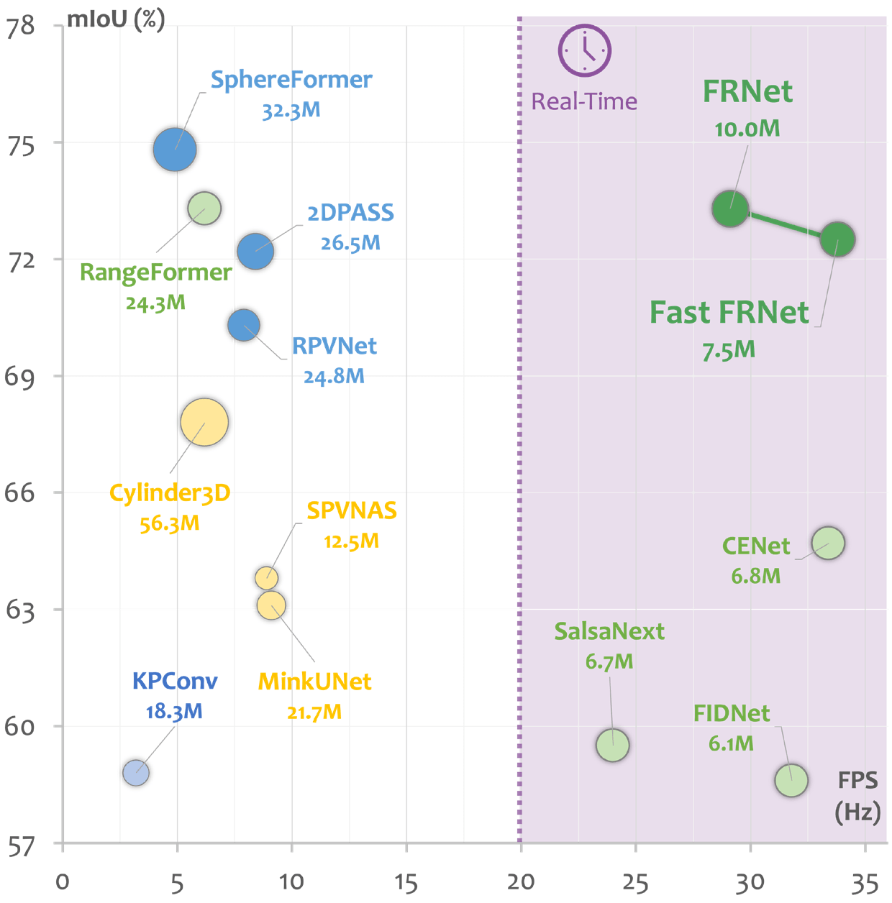
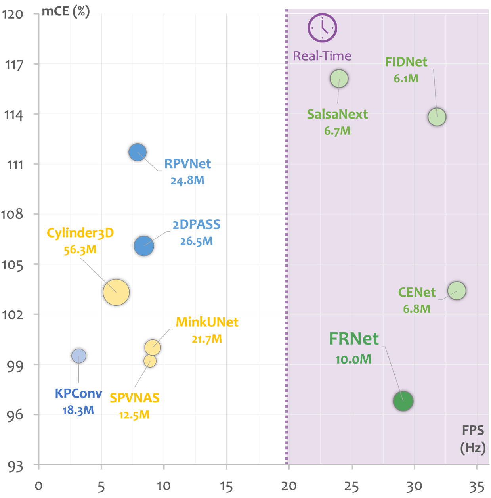
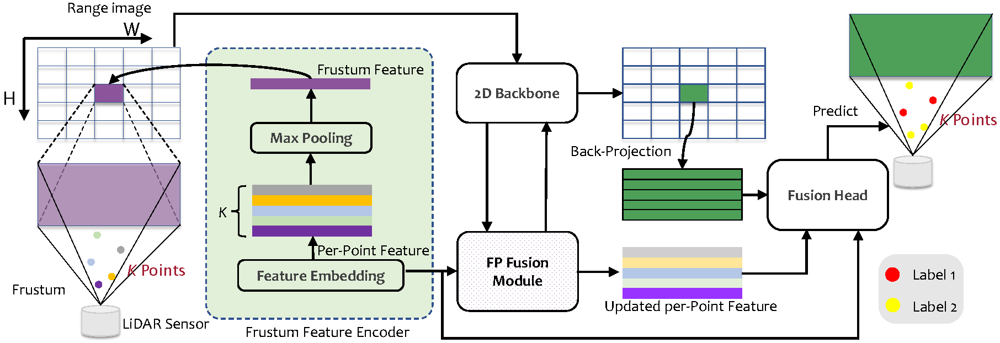

<p align="right">English | <a href="./README_CN.md">简体中文</a></p>  

<p align="center">
  
    
</p>  
  
<div align="center">
    <h2><strong>FRNet: Frustum-Range Networks for Scalable LiDAR Segmentation</strong></h2>
</div>


<div align="center">
    <a href="https://scholar.google.com/citations?user=1UHZkksAAAAJ&hl" target='_blank'>Xiang Xu</a><sup>1</sup>,&nbsp;&nbsp;
    <a href="https://scholar.google.com/citations?user=-j1j7TkAAAAJ" target='_blank'>Lingdong Kong</a><sup>2</sup>,&nbsp;&nbsp;
    <a href="https://scholar.google.com/citations?user=zG3rgUcAAAAJ&hl" target='_blank'>Hui Shuai</a><sup>3</sup>,&nbsp;&nbsp;
    <a href="https://scholar.google.com/citations?user=2Pyf20IAAAAJ&hl" target='_blank'>Qingshan Liu</a><sup>3</sup>
    </br>
    <sup>1</sup>Nanjing University of Aeronautics and Astronautics&nbsp;&nbsp;&nbsp;
    <sup>2</sup>National University of Singapore&nbsp;&nbsp;&nbsp;
    </br>
    <sup>3</sup>Nanjing University of Posts and Telecommunications&nbsp;&nbsp;&nbsp;
</div>

</br>

<div align="center">
    <a href="" target="_blank">
        
    </a>
    <a href="" target='_blank'>
        
    </a>
    <a href="https://youtu.be/PvmnaMKnZrc" target='_blank'>
        
    </a>
    <a href="" target='_blank'>
        
    </a>
    <a href="" target='_blank'>
        
    </a>
</div>

## About

**FRNet** is a simple yet efficient network for LiDAR segmentation. It consists of three key components: 1) Frustum Feature Encoder; 2) Frustum-Point Fusion Module; and 3) Head Fusion Module. Moreover, we introduce two novel argumentations, FrustumMix and RangeInterpolation, to enrich the point cloud scenes. FRNet achieves an appealing balance between accuracy and efficiency.

|  |  |
| :-----------------------------------------: | :-----------------------------------------: |
| Speed *vs.* Accuracy | Speed *vs.* Robustness |

## Updates

- \[2023.12\] - Our paper is available on [arXiv](<>), and the code is publicly available.


## Video Demo

|                   Demo 1                    |                   Demo 2                    |                   Demo 3                    |
| :-----------------------------------------: | :-----------------------------------------: | :-----------------------------------------: |
| [](https://youtu.be/PvmnaMKnZrc) | [](https://youtu.be/4m5sG-XsYgw) | [](https://youtu.be/-aM_NaZLP8M) |


## Outline

- [Installation](#installation)
- [Data Preparation](#data-preparation)
- [Getting Started](#getting-started)
- [Main Results](#main-results)
- [License](#license)
- [Acknowledgement](#acknowledgement)
- [Citation](#citation)


## Installation

Please refer to [INSTALL.md](./docs/INSTALL.md) for the installation details.


## Data Preparation

Please refer to [DATA_PREPARE.md](./docs/DATA_PREPARE.md) for the details to prepare the <sup>1</sup>[SemanticKITTI](http://www.semantic-kitti.org) and <sup>2</sup>[nuScenes](https://www.nuscenes.org) datasets.

## Getting Started

Please refer to [GET_STARTED.md](./docs/GET_STARTED.md) to learn more usage of this codebase.

## Main Results

### Framework Overview

||
|:-:|


### Comparisons to State of the Arts

<table>
    <tr>
        <th rowspan="2">Method</th>
        <th rowspan="2">Param</th>
        <th colspan="3">SemanticKITTI</th>
        <th colspan="2">nuScenes</th>
        <th colspan="2">ScribbleKITTI</th>
        <th colspan="2">SemanticPOSS</th>
    </tr>
    <tr>
        <td>FPS</td> <td>Val</td> <td>Test</td>
        <td>Val</td> <td>Test</td>
        <td>mIoU</td> <td>mAcc</td>
        <td>mIoU</td> <td>mAcc</td>
    </tr>
    <tr>
        <td>CENet</td>
        <td>6.8 M</td>
        <td>33.4</td> <td>62.6</td> <td>64.7</td>
        <td>-</td> <td>-</td>
        <td>55.7</td> <td>66.8</td>
        <td>50.3</td> <td>-</td>
    </tr>
    <tr>
        <td>RangeViT</td>
        <td>23.7 M</td>
        <td>10.0</td> <td>60.7</td> <td>64.0</td>
        <td>75.2</td> <td>-</td>
        <td>53.6</td> <td>66.5</td>
        <td>-</td> <td>-</td>
    </tr>
    <tr>
        <td><strong>Fast-FRNet</strong></td>
        <td>7.5 M</td>
        <td>33.8</td> <td>67.1</td> <td>72.5</td>
        <td>78.8</td> <td>82.1</td>
        <td>62.4</td> <td>71.2</td>
        <td>52.5</td> <td>67.1</td>
    </tr>
    <tr>
        <td><strong>FRNet</strong></td>
        <td>10.0 M</td>
        <td>29.1</td> <td>68.7</td> <td>73.3</td>
        <td>79.0</td> <td>82.5</td>
        <td>63.1</td> <td>72.3</td>
        <td>53.5</td> <td>68.1</td>
    </tr>
</table>

### Label-Efficient LiDAR Segmentation

<table>
    <tr>
        <th rowspan="2">Method</th>
        <th colspan="4">SemanticKITTI</th>
        <th colspan="4">nuScenes</th>
        <th colspan="4">ScribbleKITTI</th>
    </tr>
    <tr>
        <td>1%</td> <td>10%</td> <td>20%</td> <td>50%</td>
        <td>1%</td> <td>10%</td> <td>20%</td> <td>50%</td>
        <td>1%</td> <td>10%</td> <td>20%</td> <td>50%</td>
    </tr>
    <tr>
        <td>Sup.-only</td>
        <td>44.9</td> <td>60.4</td> <td>61.8</td> <td>63.1</td>
        <td>51.9</td> <td>68.1</td> <td>70.9</td> <td>74.6</td>
        <td>42.4</td> <td>53.5</td> <td>55.1</td> <td>57.0</td>
    </tr>
    <tr>
        <td>LaserMix</td>
        <td>52.9</td> <td>62.9</td> <td>63.2</td> <td>65.0</td>
        <td>58.7</td> <td>71.5</td> <td>72.3</td> <td>75.0</td>
        <td>45.8</td> <td>56.8</td> <td>57.7</td> <td>59.0</td>
    </tr>
    <tr>
        <td><strong>FrustumMix</strong></td>
        <td>55.8</td> <td>64.8</td> <td>65.2</td> <td>65.4</td>
        <td>61.2</td> <td>72.2</td> <td>74.6</td> <td>75.4</td>
        <td>46.6</td> <td>57.0</td> <td>59.5</td> <td>61.2</td>
    </tr>
</table>

### Robustness

<table>
    <tr>
        <th rowspan="2">Method</th>
        <th colspan="2">SemKITTI-C</th>
        <th colspan="2">nuScenes-C</th>
    </tr>
    <tr>
        <td>mCE</td> <td>mRR</td>
        <td>mCE</td> <td>mRR</td>
    </tr>
    <tr>
        <td>CENet</td>
        <td>103.4</td> <td>81.3</td>
        <td>112.8</td> <td>76.0</td>
    </tr>
    <tr>
        <td><strong>FRNet</strong></td>
        <td>96.8</td> <td>80.0</td>
        <td>98.6</td> <td>77.5</td>
    </tr>
</table>

**:memo: Note**:
- **mCE (the lower the better)**: The *average corruption error* (in percentage) of a candidate model compared to the baseline model, which is calculated among all corruption types across three severity levels.
- **mRR (the higher the better)**: The *average resilience rate* (in percentage) of a candidate model compared to its "clean" performance, which is calculated among all corruption types across three severity levels.

### Pre-trained Checkpoints
We provide the trained models for SemanticKITTI and nuScenes. The checkpoints can be downloaded from [here](https://drive.google.com/drive/folders/173ZIzO7HOSE2JQ7lz_Ikk4O85Mau68el?usp=sharing).


## License

This work is under the [Apache 2.0 license](LICENSE).


## Acknowledgement

This work is developed based on the [MMDetection3D](https://github.com/open-mmlab/mmdetection3d) codebase.
><br>
> MMDetection3D is an open-source object detection toolbox based on PyTorch, towards the next-generation platform for general 3D perception. It is a part of the OpenMMLab project developed by MMLab.


We acknowledge the use of the following public resources during the course of this work: <sup>1</sup>[SemanticKITTI](http://www.semantic-kitti.org), <sup>2</sup>[SemanticKITTI-API](https://github.com/PRBonn/semantic-kitti-api), <sup>3</sup>[nuScenes](https://www.nuscenes.org/nuscenes), <sup>4</sup>[nuScenes-devkit](https://github.com/nutonomy/nuscenes-devkit), <sup>5</sup>[ScribbleKITTI](https://github.com/ouenal/scribblekitti), <sup>6</sup>[SemanticPOSS](http://www.poss.pku.edu.cn/semanticposs.html), <sup>7</sup>[SemanticPOSS-API](https://github.com/Theia-4869/semantic-poss-api), <sup>8</sup>[Robo3D](https://github.com/ldkong1205/Robo3D), <sup>9</sup>[PCSeg](https://github.com/PJLab-ADG/PCSeg), <sup>10</sup>[SalsaNext](https://github.com/TiagoCortinhal/SalsaNext), <sup>11</sup>[FIDNet](https://github.com/placeforyiming/IROS21-FIDNet-SemanticKITTI), <sup>12</sup>[CENet](https://github.com/huixiancheng/CENet), <sup>13</sup>[RangeViT](https://github.com/valeoai/rangevit), <sup>14</sup>[SphereFormer](https://github.com/dvlab-research/SphereFormer), <sup>15</sup>[2DPASS](https://github.com/yanx27/2DPASS), <sup>16</sup>[Cylinder3D](https://github.com/xinge008/Cylinder3D), <sup>17</sup>[SPVNAS](https://github.com/mit-han-lab/spvnas), <sup>18</sup>[KPConv](https://github.com/HuguesTHOMAS/KPConv-PyTorch), and <sup>19</sup>[LaserMix](https://github.com/ldkong1205/LaserMix).

## Citation

If you find this work helpful, please kindly consider citing our paper:

```latex

```
