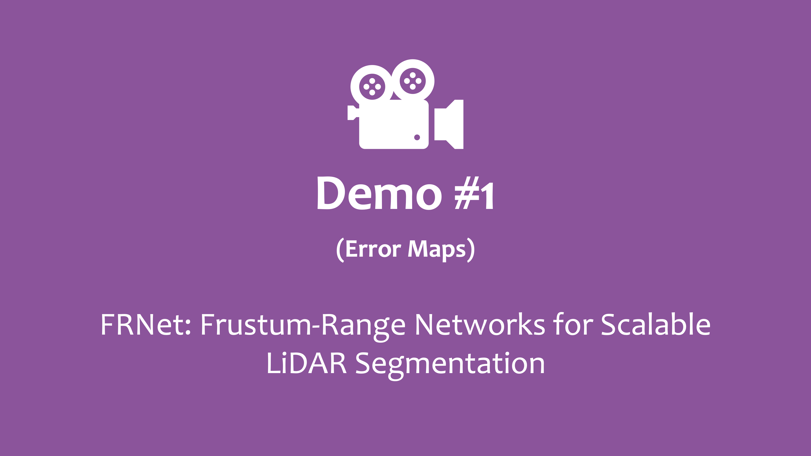
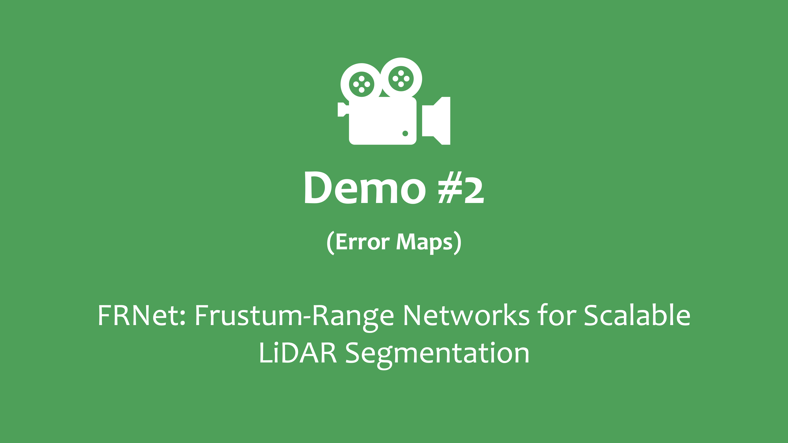
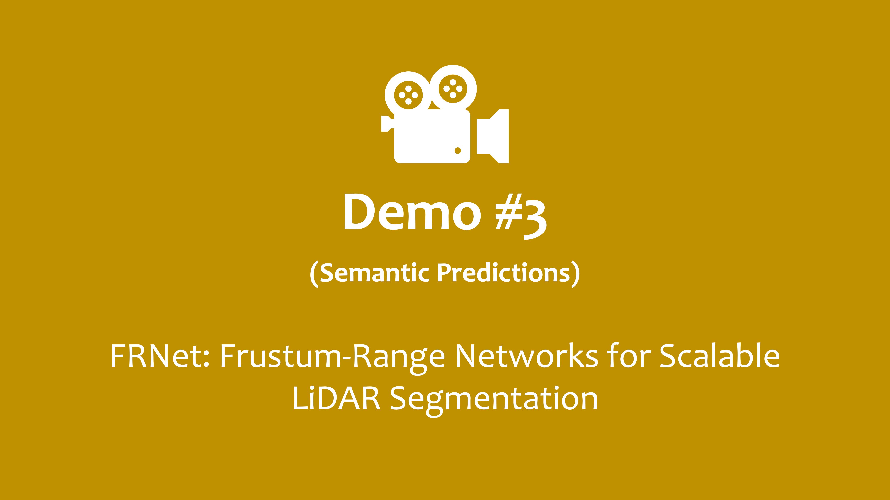

<div align="right"><a href="./README.md">English</a> | 简体中文</div>

<div align="center">
    
</div>

<div align="center">
    <h2><strong>FRNet: Frustum-Range Networks for Scalable LiDAR Segmentation</strong></h2>
</div>

<div align="center">
    <a href="https://scholar.google.com/citations?user=1UHZkksAAAAJ" target='_blank'>许翔</a><sup>1</sup>,&nbsp;&nbsp;
    <a href="https://scholar.google.com/citations?user=-j1j7TkAAAAJ" target='_blank'>孔令东</a><sup>2</sup>,&nbsp;&nbsp;
    <a href="https://scholar.google.com/citations?user=zG3rgUcAAAAJ" target='_blank'>帅惠</a><sup>3</sup>,&nbsp;&nbsp;
    <a href="https://scholar.google.com/citations?user=2Pyf20IAAAAJ" target='_blank'>刘青山</a><sup>3</sup>
    </br>
    <sup>1</sup>南京航空航天大学&nbsp;&nbsp;&nbsp;
    <sup>2</sup>新加坡国立大学&nbsp;&nbsp;&nbsp;
    <sup>3</sup>南京邮电大学&nbsp;&nbsp;&nbsp;
</div>

</br>

<div align="center">
    <a href="https://arxiv.org/abs/2312.04484" target="_blank">
        
    </a>
    <a href="https://xiangxu-0103.github.io/FRNet" target='_blank'>
        
    </a>
    <a href="https://youtu.be/PvmnaMKnZrc" target='_blank'>
        
    </a>
    <a href="" target='_blank'>
        
    </a>
    <a href="" target='_blank'>
        
    </a>
</div>

## 概述

**FRNet** 是一种简单且有效的激光雷达分割器。它包含 3 个主要模块：1）Frustum Feature Encoder；2）Frustum-Point Fusion Module；以及 3）Head Fusion Module。此外，我们还提出两种新的数据增强方式，FrustumMix 以及 RangeInterpolation，来丰富点云场景。

**FRNet** 在准确率和效率之间达到了良好的平衡性，从而实现实时点云分割。

|  |  |
| :----------------------------------------------------------: | :----------------------------------------------------------: |
|                     Speed *vs.* Accuracy                     |                    Speed *vs.* Robustness                    |

在我们的[项目主页](https://xiangxu-0103.github.io/FRNet)获取更多示例。 :car:

## 更新

- \[2024.04\] - 我们进一步优化了论文以及部分代码。
- \[2023.12\] - 我们提供了在 SemanticKITTI 以及 nuScenes 上的训练权重。权重文件可以在[此处](https://drive.google.com/drive/folders/173ZIzO7HOSE2JQ7lz_Ikk4O85Mau68el?usp=sharing)下载。
- \[2023.12\] - 我们的论文在[arXiv](https://arxiv.org/abs/2312.04484)上发布，并公开我们的代码。

## :movie_camera: 视频演示

|                           Demo 1                            |                           Demo 2                            |                           Demo 3                            |
| :---------------------------------------------------------: | :---------------------------------------------------------: | :---------------------------------------------------------: |
|  |  |  |
|          [\[Link\]](https://youtu.be/PvmnaMKnZrc)           |          [\[Link\]](https://youtu.be/4m5sG-XsYgw)           |          [\[Link\]](https://youtu.be/-aM_NaZLP8M)           |

## 目录

- [安装](#gear-安装)
- [数据准备](#hotsprings-数据准备)
- [开始](#rocket-开始)
- [主要结果](#bar_chart-主要结果)
- [许可证](#许可证)
- [引用](#引用)
- [致谢](#致谢)

## :gear: 安装

请参考[安装文档](./docs/INSTALL.md)获取安装细节。

## :hotsprings: 数据准备

请参考[数据准备文档](./docs/DATA_PREPARE.md)了解如何准备 <sup>1</sup>[SemanticKITTI](http://www.semantic-kitti.org) 以及 <sup>2</sup>[nuScenes](https://www.nuscenes.org) 数据集。

## :rocket: 开始

请参考[开始文档](./docs/GET_STARTED.md)了解如何使用本代码库。

## :bar_chart: 主要结果

### 整体框架

|  |
| :------------------------------------------------------------: |

### 与 SoTA 的对比

<table>
    <tr>
        <th rowspan="2">Method</th>
        <th rowspan="2">Param</th>
        <th colspan="3">SemanticKITTI</th>
        <th colspan="2">nuScenes</th>
        <th colspan="2">ScribbleKITTI</th>
        <th colspan="2">SemanticPOSS</th>
    </tr>
    <tr>
        <td>FPS</td> <td>Val</td> <td>Test</td>
        <td>Val</td> <td>Test</td>
        <td>mIoU</td> <td>mAcc</td>
        <td>mIoU</td> <td>mAcc</td>
    </tr>
    <tr>
        <td>CENet</td>
        <td>6.8 M</td>
        <td>33.4</td> <td>62.6</td> <td>64.7</td>
        <td>-</td> <td>-</td>
        <td>55.7</td> <td>66.8</td>
        <td>50.3</td> <td>-</td>
    </tr>
    <tr>
        <td>RangeViT</td>
        <td>23.7 M</td>
        <td>10.0</td> <td>60.7</td> <td>64.0</td>
        <td>75.2</td> <td>-</td>
        <td>53.6</td> <td>66.5</td>
        <td>-</td> <td>-</td>
    </tr>
    <tr>
        <td><strong>Fast-FRNet</strong></td>
        <td>7.5 M</td>
        <td>33.8</td> <td>67.1</td> <td>72.5</td>
        <td>78.8</td> <td>82.1</td>
        <td>62.4</td> <td>71.2</td>
        <td>52.5</td> <td>67.1</td>
    </tr>
    <tr>
        <td><strong>FRNet</strong></td>
        <td>10.0 M</td>
        <td>29.1</td> <td>68.7</td> <td>73.3</td>
        <td>79.0</td> <td>82.5</td>
        <td>63.1</td> <td>72.3</td>
        <td>53.5</td> <td>68.1</td>
    </tr>
</table>

### 标签高效激光雷达分割

<table>
    <tr>
        <th rowspan="2">Method</th>
        <th colspan="4">SemanticKITTI</th>
        <th colspan="4">nuScenes</th>
        <th colspan="4">ScribbleKITTI</th>
    </tr>
    <tr>
        <td>1%</td> <td>10%</td> <td>20%</td> <td>50%</td>
        <td>1%</td> <td>10%</td> <td>20%</td> <td>50%</td>
        <td>1%</td> <td>10%</td> <td>20%</td> <td>50%</td>
    </tr>
    <tr>
        <td>Sup.-only</td>
        <td>44.9</td> <td>60.4</td> <td>61.8</td> <td>63.1</td>
        <td>51.9</td> <td>68.1</td> <td>70.9</td> <td>74.6</td>
        <td>42.4</td> <td>53.5</td> <td>55.1</td> <td>57.0</td>
    </tr>
    <tr>
        <td>LaserMix</td>
        <td>52.9</td> <td>62.9</td> <td>63.2</td> <td>65.0</td>
        <td>58.7</td> <td>71.5</td> <td>72.3</td> <td>75.0</td>
        <td>45.8</td> <td>56.8</td> <td>57.7</td> <td>59.0</td>
    </tr>
    <tr>
        <td><strong>FrustumMix</strong></td>
        <td>55.8</td> <td>64.8</td> <td>65.2</td> <td>65.4</td>
        <td>61.2</td> <td>72.2</td> <td>74.6</td> <td>75.4</td>
        <td>46.6</td> <td>57.0</td> <td>59.5</td> <td>61.2</td>
    </tr>
</table>

### 鲁棒性

<table>
    <tr>
        <th rowspan="2">Method</th>
        <th colspan="2">SemKITTI-C</th>
        <th colspan="2">nuScenes-C</th>
    </tr>
    <tr>
        <td>mCE</td> <td>mRR</td>
        <td>mCE</td> <td>mRR</td>
    </tr>
    <tr>
        <td>CENet</td>
        <td>103.4</td> <td>81.3</td>
        <td>112.8</td> <td>76.0</td>
    </tr>
    <tr>
        <td><strong>FRNet</strong></td>
        <td>96.8</td> <td>80.0</td>
        <td>98.6</td> <td>77.5</td>
    </tr>
</table>

**:memo: 注意**：

- **mCE（越低越好）**：候选模型相比于基准模型的*平均损坏率*（百分比），它是对所有损坏类型中三种严重级别的计算所得。
- **mRR（越高越好）**: 候选模型相比于其在“干净”数据集性能的*平均恢复率*（百分比），它是对所有损坏类型中三种严重级别的计算所得。

### :round_pushpin: 训练权重

我们提供了 SemanticKITTI 和 nuScenes 上的训练权重。权重文件可以在[此处](https://drive.google.com/drive/folders/173ZIzO7HOSE2JQ7lz_Ikk4O85Mau68el?usp=sharing)下载。

## 许可证

该工作采用 [Apache 2.0 开源许可证](LICENSE)。

## 引用

如果你觉得本工作对你有所帮助，请考虑参照如下引用我们的论文：

```bibtex
@article{xu2023frnet,
    title = {FRNet: Frustum-Range Networks for Scalable LiDAR Segmentation},
    author = {Xu, Xiang and Kong, Lingdong and Shuai, Hui and Liu, Qingshan},
    journal = {arXiv preprint arXiv:2312.04484},
    year = {2023}
}
```

## 致谢

该工作基于[MMDetection3D](https://github.com/open-mmlab/mmdetection3d)代码库开发。

> <br>
> MMDetection3D 是一个基于 PyTorch 的目标检测开源工具箱，下一代面向 3D 感知平台。它是 OpenMMLab 项目的一部分。

我们感谢在该项工作中使用到的如下开源库：<sup>1</sup>[SemanticKITTI](http://www.semantic-kitti.org)，<sup>2</sup>[SemanticKITTI-API](https://github.com/PRBonn/semantic-kitti-api)，<sup>3</sup>[nuScenes](https://www.nuscenes.org/nuscenes)，<sup>4</sup>[nuScenes-devkit](https://github.com/nutonomy/nuscenes-devkit)，<sup>5</sup>[ScribbleKITTI](https://github.com/ouenal/scribblekitti)，<sup>6</sup>[SemanticPOSS](http://www.poss.pku.edu.cn/semanticposs.html)，<sup>7</sup>[SemanticPOSS-API](https://github.com/Theia-4869/semantic-poss-api)，<sup>8</sup>[Robo3D](https://github.com/ldkong1205/Robo3D)，<sup>9</sup>[PCSeg](https://github.com/PJLab-ADG/PCSeg)，<sup>10</sup>[SalsaNext](https://github.com/TiagoCortinhal/SalsaNext)，<sup>11</sup>[FIDNet](https://github.com/placeforyiming/IROS21-FIDNet-SemanticKITTI)，<sup>12</sup>[CENet](https://github.com/huixiancheng/CENet)，<sup>13</sup>[RangeViT](https://github.com/valeoai/rangevit)，<sup>14</sup>[SphereFormer](https://github.com/dvlab-research/SphereFormer)，<sup>15</sup>[2DPASS](https://github.com/yanx27/2DPASS)，<sup>16</sup>[Cylinder3D](https://github.com/xinge008/Cylinder3D)，<sup>17</sup>[SPVNAS](https://github.com/mit-han-lab/spvnas)，<sup>18</sup>[KPConv](https://github.com/HuguesTHOMAS/KPConv-PyTorch) 以及 <sup>19</sup>[LaserMix](https://github.com/ldkong1205/LaserMix). :heart_decoration:
